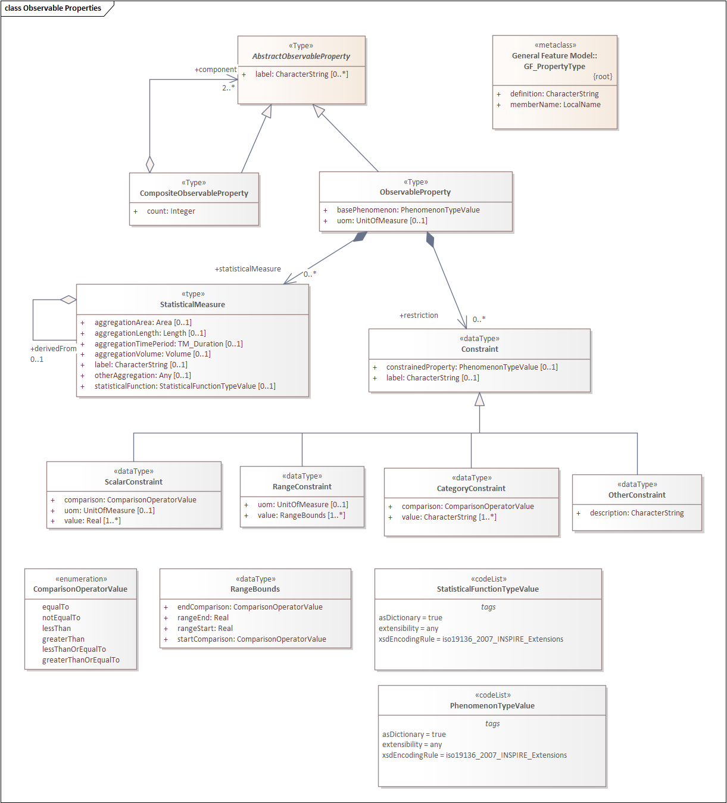
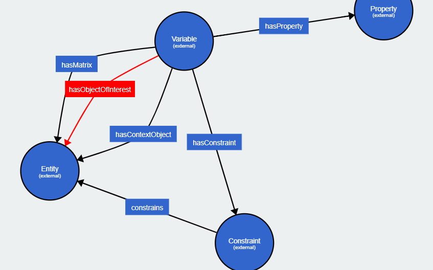

# Scope

This document discusses the potential scope for a standardization activity for the publication of descriptions of “observable properties” (OP). This activity is proposed as an optional module of the SOSA/SSN model to provide a canonical model for sharing observable property definitions.

This model will not be mandatory, allowing existing models for these concepts already extending SOSA to continue to be compliant, but will allow publication of alignment (or transformation) models between such legacy extensions and a common interoperable form.

Note properties of “real world” features may be abstract and not necessarily “observable” in a physical sense, and may be observed by arbitrarily complex processes, such as AI based predictions. Note that features themselves need not correspond to physical things, but may be any identifiable information object describing some phenomena or abstraction.

The key goals of this activity are:

1.  Allow exchange, reuse and federation of OP descriptions in systems-of-systems contexts (e.g. Digital Twins)
2.  Provide standardized access to OP descriptions to support reusability of system functions such as discovery, classification and transformation of data
3.  Allow development of a suite of OGC API Building Blocks for standardized data exchange and query using OP definitions.

This scope is complementary to the ISO 19156 standard (and the SOSA ontology) which treats ObservableProperty as an abstract concept without further detail. It provides an option for implementing these concepts but does not require any update of these base models.

OP is related to the concept of “variables”, the method or procedure utilized to ascertain the result (value) of an observation and the units of measure used to characterize them, and includes the additional aspect of how the state of specific domain features are characterized by such measurements.

Interoperability of these descriptions according to FAIR principles is crucial for the sharing of “essential variables”across many persistent information infrastructures supporting cross domain activities.[^1]

[^1]: https://public.wmo.int/en/programmes/global-climate-observing-system/essential-climate-variables

## Relationship with OGC and other SDO standards baseline

ObservedProperty is an abstract class under ISO 19156 Observations and Measurements, and likewise with the OGC/W3C SOSA ontology version of this.

A number of activities have proposed models, and many systems have local implementations of “variables” registers, however no formal model governed by an international Standards Development Organization (SDO) has been identified.

## Relationship with existing OGC API Building Blocks

An approach to define the semantics of OGC API Building blocks is under development, and the availability of an ObservableProperties model will allow both schemas and semantic annotations to be implemented. These can then be coupled with query parameters to define an OpenAPI interface for accessing observable property definitions. This API-level building block can augment any other access API - such as Features, Records, EDR, STA and ConnectedSystems to offer optional access to property definitions.

Arguably, an observable properties register is an extension of a core “definitions” register - i.e. an OpenAPI successor to the SISSVoc API concept, compatible with the OGC API core (<https://ogcapi.ogc.org/common/overview.html>) - in such a model skos:ConceptSchemes would equate to “Registers” which would be a specialised form of /collections with governance metadata requirements.

This has three advantages:

-   This API can be used by itself for registries of ObservableProperties
-   A client can always access the same endpoint as it receives data from, without having to deal with wider issues of network access and security (“same-origin security policy”)
-   A data source can offer property descriptions independently of external registration processes - and these can be harvested by data catalogs if required.

Observable Properties is a **subset** of the concept of “parameters” as used in the [OGC EDR API](https://ogcapi.ogc.org/edr/overview.html), in the sense that parameters relate to both the measured properties and the dimensions of measurement in multi-dimensional coverages. Observation of the state of a feature is related to a general problem of transparently describing the properties of features (in the sense of ISO 19109).

The OGC EDR API defines a reusable “building block” to define the schema linking an external descriptions of an observable property to an API query model or access service description (see <https://github.com/opengeospatial/bblocks/blob/master/registereditems/geo/edr/json-parameter-names.adoc> ). Note this does **not** provide a model for observable property description, or a reusable conceptual model for this relationship, but does provide an annotated link to such a description.

# Standardization Process

The Spatial Data on the Web Working Group has a mandate (till end 2023) to maintain the SOSA/SSN specification. It was proposed (by RA) in Feb 2023 that this activity includes and optional module for the standardization of observable properties descriptions and the implementation of these in at least the following circumstances:

1.  As a **building block** for reuse in OGC API profiles
2.  As a **conceptual model** package for reuse in data models
3.  As an **ontology** for reuse in semantic descriptions

Collectively these would enable a federated approach to publication and sharing of these descriptions across multiple systems.

The outputs of this activity would be assumed to be adopted by:

-   [OGC Observations and Measurements SWG](https://www.ogc.org/standards/om)
-   [OGC EDR API SWG](https://www.ogc.org/projects/groups/edr-apiswg)
-   GeoSemantics DWG
-   SensorThings API
-   Connected Systems SWG

# Background

There are many initiatives publishing “variables”, “sensor types”, “observable properties” etc. There appears to be no consensus on standardized ways to describe such variables, and standardized ways to publish, access, exchange and re-use sets of such variables.

A number of ontologies and data models for such descriptions exist, in addition to basic definitions using taxonomy standards.

A core problem seems to be the level of abstraction of such descriptions - and consistency in the boundary between describing the phenomenon, the results of measurements using particular procedures, and the structural details of how such values are attached to the logical models of geographic features.

Multiple candidate models exist - such as:

-   (Please list your favorites)
-   INSPIRE Observable Properties model
-   I-ADOPT
-   PUV
    -   ontology <https://github.com/CSIRO-enviro-informatics/PUV-ont>

The INSPIRE model includes statistical measures:

Given the statistical data is commonly spatio-temporal in nature, there is an obvious role of OGC in defining a descriptive model for these aspects, and stepping in to address the lack of coordination in the general community.

The IADOPT model (<https://i-adopt.github.io/index.html>) has an overlapping scope describing how variables related properties to entities:

The SWEET Ontology (<https://github.com/ESIPFed/sweet>) takes an approach of defining a class hierarchy for the observable property space, rather than a model for how observable properties can be specified and documented.

| Example of a SWEET property definition.             |
|-----------------------------------------------------|
| soprop:HydrogeologicalProperty rdf:type owl:Class ; |
|  rdfs:subClassOf soprop:GeologicalProperty ,        |
|  [ rdf:type owl:Restriction ;                       |
|  owl:onProperty sorelh:studyOf ;                    |
|  owl:someValuesFrom sohukd:Hydrology                |
|  ] ;                                                |
|  rdfs:label "hydrogeological property"@en .         |

Note that (AFAICT from browsing various sites) the SWEET model does not provide detailed definitions or relations to other types of definition, even though it includes many other aspects such as methods. Regardless, a conceptual model would need to be “factored out for reuse” in order to leverage SWEET content.

# Motivations

In addition to the existence of multiple activities, there is a motivation for the OGC itself to demonstrate effective practices (“best” not being good enough yet) for interoperability using its published standards baseline.

We have multiple external stakeholders requesting support in either:

-   implementation standards for architectures that include observable properties
-   Hosting of best practice examples
-   Hosting of registers for use in standardized domain models

Whilst the OGC has the capability to host registers using arbitrary semantic models, we do not have the capability to host multiple similar-but-different versions of such things and negotiate the inevitable confusion this would cause.

In addition, we have an explicit request for assistance in generalizing the “parameter” concept for the OGC EDR API to be used as a building block to extend OGC API Features in a consistent fashion.

# Requirements

1.  Standardized mechanism to link an observable property definition to a property of a Feature in OGC API responses, as an OGC API Building block
2.  Standardized mechanism to describe query parameters for OGC APIs linked to registered (FAIR) property descriptions
3.  Formal ontology published as FAIR linked data (i.e. with dereferencable identifiers) for describing the items (contents) of registers of observable properties and variables.
4.  Standardized mechanisms for linking phenomenon classification, measured variable and logical feature property levels of abstraction in a FAIR way.
5.  Alignment (mappings) to existing (heterogeneous) models in use in persistent infrastructures
6.  Register federation mechanisms to allow republishing of authoritative definitions in a canonical standardized form
7.  Register federation mechanisms to define reuse of subsets of definitions in a specific application context
8.  Link with Measurement Procedures, Units of Measure

# Governance

This activity is not about the governance of such registers, but is an enabler to establish clarity and interoperability of the content of such registers, so that various alternative federation and governance options can be exercised without creating competing, inconsistent islands of information.

The governance of the standard itself will be handled by the SOSA maintenance process, being an optional extension..

To host specific registers based on the standard OGC will need to develop P&P for hosted content, however this is exponentially harder as numbers of stakeholders grow without consistency of register design. The immediate need is to establish a common model and API accessors.
